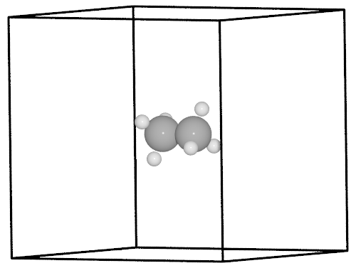
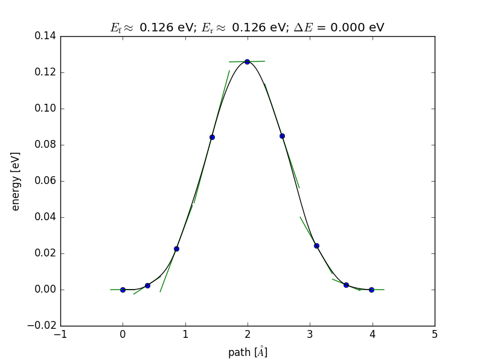

 .. sectionauthor:: Rasmus Yding Brogaard <rasmus.brogaard@gmail.com>

NEBEspresso
===========
Derived from the :class:`ase.neb.NEB` class, :class:`NEBEspresso` orchestrates (i)Espresso calculators of individual images in a NEB calculation. This way a :class:`NEBEspresso` object facilitates parallel NEB jobs, where each image calculator uses a subset of the pool of CPUs available to the job.

This tutorial explains the use of :class:`NEBEspresso` to do a NEB calculation on methyl group rotation in ethane, built on `this ASE example <http://wiki.fysik.dtu.dk/ase/tutorials/neb/idpp.html#example-1-ethane>`_.

Initial and final structures of the NEB
----------------------------------------
As opposed to the Effective Medium Potential used in the original example, Quantum Espresso needs periodic boundaries defined by a unit cell. That is defined in the ``ethane.traj`` trajectory file containing the optimized structure. The final structure is created simply by permuting the H atoms in one of the methyl groups.

.. code-block:: python

   from espresso import iEspresso
   from ase.io import read

   initial = read('ethane.traj')
   initial.get_potential_energy()
   final = initial.copy()
   final.positions[2:5] = initial.positions[[3, 4, 2]]
   final.get_potential_energy()

Assigning calculators to intermediate images
-------------------------------------------------------
Initially, images are created as copies of the initial structure and are each asssigned a calculator. Here we use the interactive :class:`iEspresso` calculator, but the non-interactive :class:`Espresso` calculator is equally valid.

.. code-block:: python

   images = [initial]
   for _ in range(7):
       image = initial.copy()
       image.set_calculator(iEspresso(pw=300, dw=4000,kpts='gamma',xc='PBE'))
       images.append(image)
   images.append(final)

Running the NEB calculation and analyzing the results
-------------------------------------------------------
The :class:`NEBEspresso` class is instantiated with the list of images and is used just as the :class:`ase.neb.NEB` super class, with one exception: the ``parallel`` keyword. :class:`NEBEspresso` ignores ``'parallel'=False`` and will always attempt to distribute the image calculators over the CPU pool available to the job. 

.. code-block:: python

   from espresso.nebespresso import NEBEspresso
   from ase.optimize.fire import FIRE as QuasiNewton
   
   neb = NEBEspresso(images)
   neb.interpolate('idpp')

   qn = QuasiNewton(neb, logfile='ethane_linear.log', trajectory='neb.traj')
   qn.run(fmax=0.05)

   from ase.neb import NEBTools
   nt = NEBTools(neb.images)
   fig = nt.plot_band()
   fig.savefig('rotation-barrier.png')

